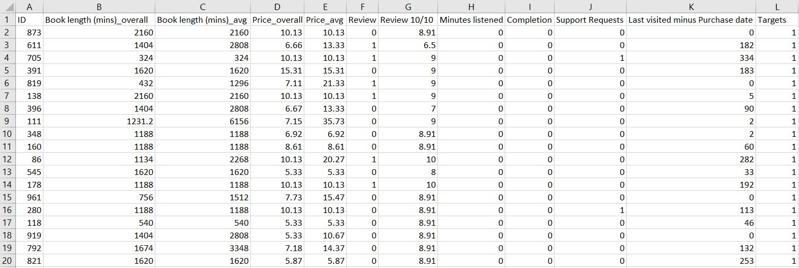
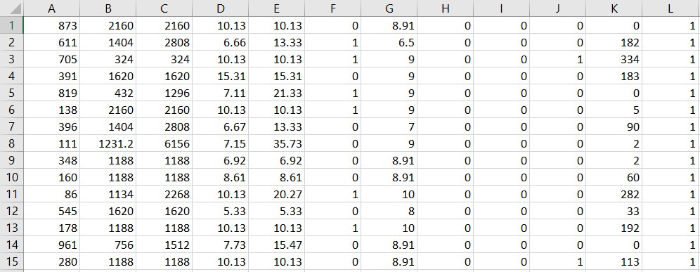

# Audiobooks Repurchase Prediction
## Project overview and result
We predicted the probability of repurchasing audiobooks in an online shop with Deep Learning model.  
We achieved **92.17%** accuracy in Validation set and **88.17%** accuracy on Test Set 

## Dataset
This is data from an online shop selling audiobooks.  
14,084 rows excluding the columns name  
12 columns (11 features and 1 target)  
This is an example of our data.  
  
**Note that**, in our **Audiobook_data.csv**, We have deleted all of the columns name because we will use numpy to load the data here, not pandas. So the real data will look like this.  
  

## Plan to attack
1. Preprocess the data
2. Standardize
3. Train/Validation/Test splits
4. Save data to .npz files for future usages
5. Build a model
6. Train and Test the model on the train, validation, and test set
7. Export the model and scaler with pickle and .h5
8. Test the model again on the whole new dataset (To make sure it works)

## Model architecture
With the ease of task, we used a very simple model architecture here: **Dense -> Dense -> Dense**  
The first 2 layers use dense_size of 50 and 'relu', the last one used dense_size of 2 and 'softmax'.  
We can use output_size = 1, use 'sigmoid', and use binary crossentropy too.  
But for this task we want to try this model architecture.

## Libraies
numpy, tensorflow, sklearn, pickle

## Thank you for reaching out! :D
